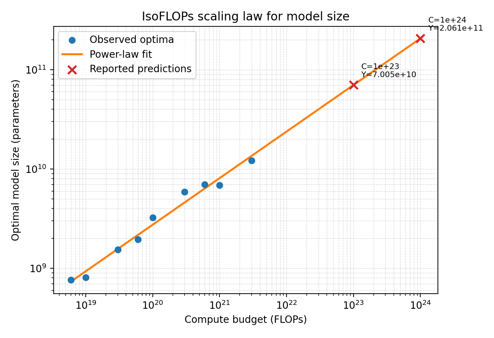
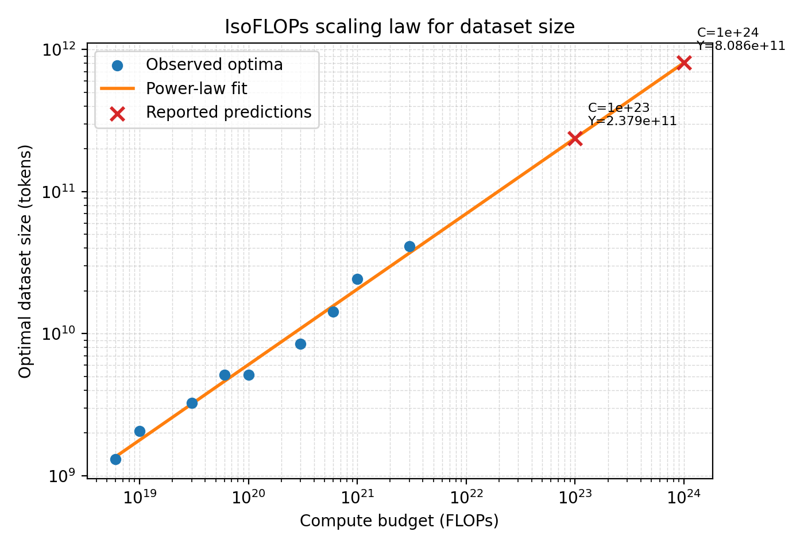
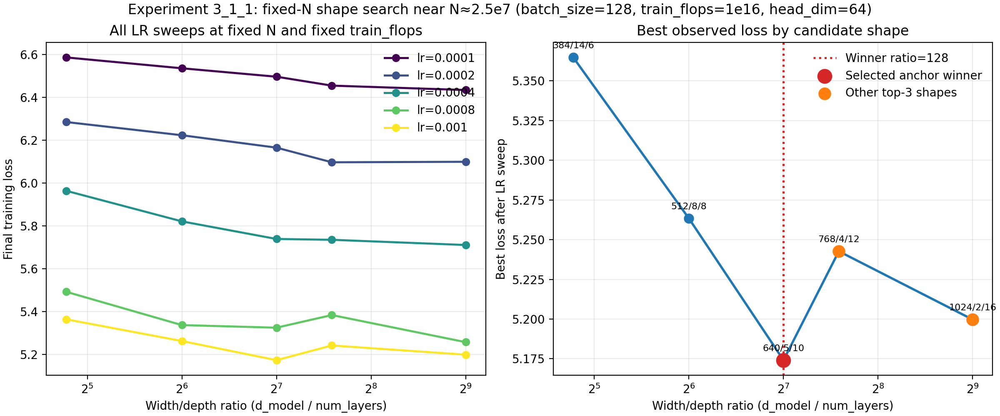
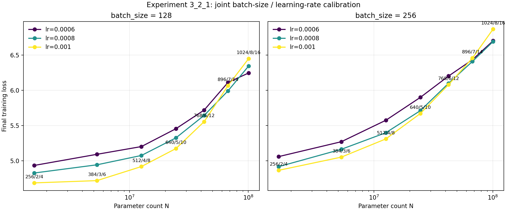
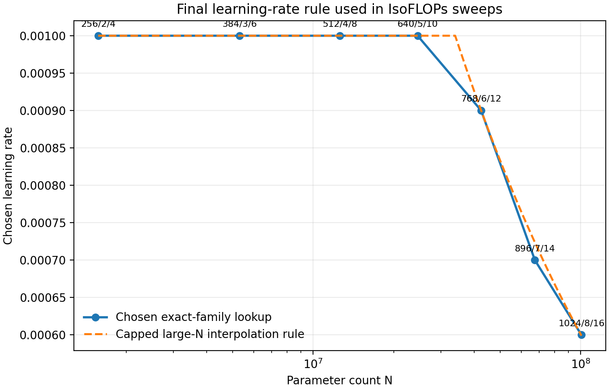
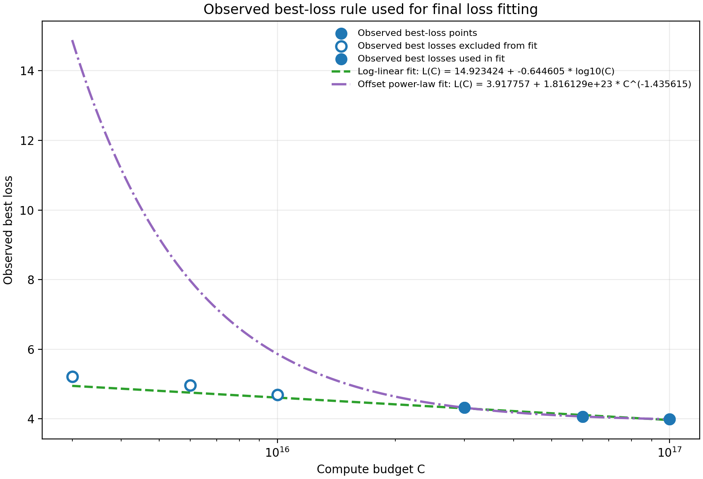
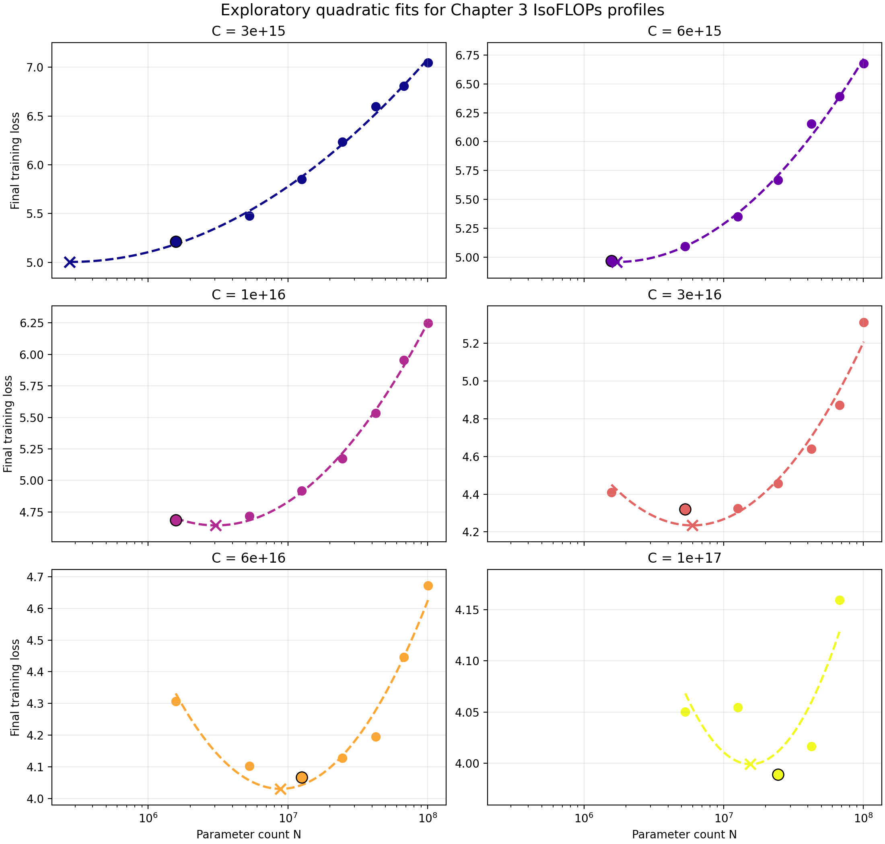
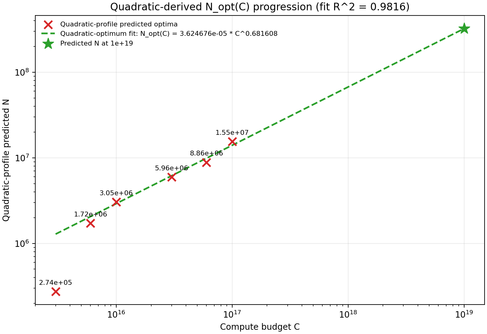
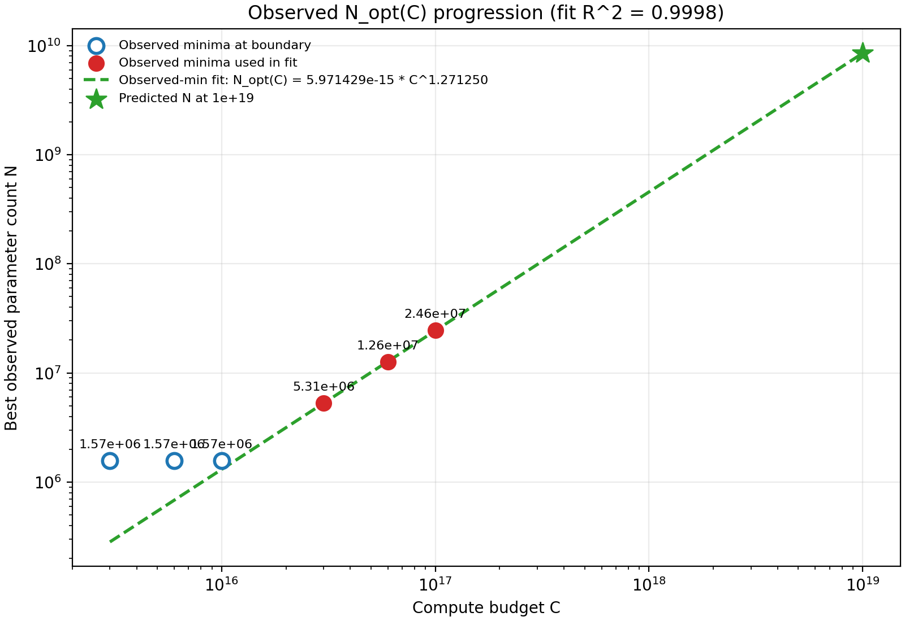
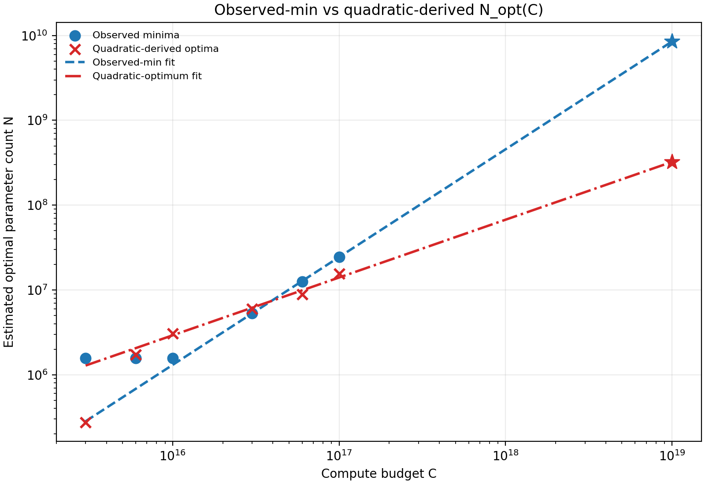

## Problem `chinchilla_isoflops`: 5 points

### (a)
**Question:** Show your extrapolated compute-optimal model size, together with the $\langle C_i, N_{\mathrm{opt}}(C_i) \rangle$ points you obtained. What is your predicted optimal model size for a budget of `1e23` FLOPs? What about for `1e24` FLOPs?  
**Deliverable:** A plot showing your scaling law for model size by compute budget, showing the data points used to fit the scaling law and extrapolating up to at least `1e24` FLOPs. Then, a one-sentence response with your predicted optimal model size.  

**Answer:**  
The synthetic runs in `data/isoflops_curves.json` were loaded, grouped by compute budget, and the minimum-loss run within each budget was selected. Following the handout's suggested simplification, the observed minimum was treated directly as $N_{\mathrm{opt}}(C_i)$ rather than fitting a separate quadratic minimum inside each IsoFLOPs profile. A power law was then fit to the resulting $\langle C_i, N_{\mathrm{opt}}(C_i) \rangle$ points with ordinary least squares in log-log space, which gave

$$
N_{\mathrm{opt}}(C) = 1.163411 \times 10^{0} \cdot C^{0.468683}
$$

with $R^2 = 0.9787$.

Figure 1 shows both the observed optimal points and the fitted scaling law. Using this fit, the predicted compute-optimal model size is approximately `7.01e10` parameters at `1e23` FLOPs and `2.06e11` parameters at `1e24` FLOPs.

### (b)
**Question:** Show your extrapolated compute-optimal dataset size, together with the $\langle C_i, D_{\mathrm{opt}}(C_i) \rangle$ data points from the training runs. What is your predicted optimal dataset size for budgets of `1e23` and `1e24` FLOPs?  
**Deliverable:** A plot showing your scaling law for dataset size by compute budget, showing the data points used to fit the scaling law and extrapolating up to at least `1e24` FLOPs. Then, a one-sentence response with your predicted optimal dataset size.  

**Answer:**  
After selecting the minimum-loss run for each compute budget, the optimal parameter count was converted into an optimal dataset size using the Chinchilla accounting relation

$$
C = 6ND, \qquad D_{\mathrm{opt}}(C_i) = \frac{C_i}{6N_{\mathrm{opt}}(C_i)}.
$$

A second power law was then fit to the resulting $\langle C_i, D_{\mathrm{opt}}(C_i) \rangle$ points in log-log space, which gave

$$
D_{\mathrm{opt}}(C) = 1.432570 \times 10^{-1} \cdot C^{0.531317}
$$

with $R^2 = 0.9834$.

Figure 2 shows the observed optimal dataset sizes together with the fitted law. Using this fit, the predicted compute-optimal dataset size is approximately `2.38e11` tokens at `1e23` FLOPs and `8.09e11` tokens at `1e24` FLOPs.

As a sanity check, the fitted exponents satisfy $0.468683 + 0.531317 \approx 1$, which is consistent with $D = C / (6N)$ and shows that the two fitted laws are mutually consistent. The selected optimal points are not perfectly monotonic because they come from taking the best observed run on a discrete synthetic grid, but the overall log-log trend remains smooth and is well approximated by a power law.

---

## Problem `scaling_laws`: 50 points

**Question:** Construct a scaling law to accurately predict the optimal model size, its hyperparameters, and the associated training loss for a FLOPs budget of `1e19`. To construct your scaling laws, you will use our training API to query the final training loss for various experimental configurations (§3.1); you may not query more than `2e18` FLOPs worth of experiments for fitting your scaling law. This is hard cap that will be enforced by the API.  
**Deliverable:** A typeset write-up that contains a complete description of your approach and methodology for fitting a scaling law. In addition, it should describe how you use the scaling law to predict the optimal model size for the given FLOPs budget, and your predicted values. The write-up should include commentary about why you made particular design decisions, and the description should be detailed enough to reproduce your approach and results.  

**Answer:**  
### 1. Goal and Budgeting Strategy

The goal was to predict the compute-optimal model size, training hyperparameters, and final training loss at a target budget of `1e19` FLOPs, while keeping all exploratory API queries within the assignment's `2e18`-FLOP budget. Instead of treating the API as a black-box optimization problem over the full configuration space, the budget was explicitly split into three stages, each answering a different question needed for the final scaling-law fit.

In the first stage, a small fraction of the budget was allocated to fixed-`N` shape search. The purpose of this stage was not to fit the final scaling law, but to determine a deterministic model family by comparing several architecture shapes with roughly matched parameter counts and identifying a stable width/depth ratio and head-dimension rule. In the second stage, after fixing this shape family, another controlled portion of the budget was used to calibrate hyperparameters under IsoFLOPs-style conditions. In particular, how `batch_size` and `learning_rate` should be chosen once the architecture family had been fixed was studied, including a separate refinement pass for the largest models. Only in the third stage was the bulk of the budget spent on the main IsoFLOPs experiments, whose purpose was to estimate $N_{\mathrm{opt}}(C)$ directly by comparing model sizes across multiple compute budgets.

This staged allocation was deliberate. The first two stages reduced variance from architecture and optimizer choices before the main scaling-law fit, so that the final IsoFLOPs sweeps could focus on the central question of interest: how the compute-optimal model size grows with compute budget. The final report therefore does not mirror the chronological order of every API call, but it does preserve this experimental logic: first restrict the search space, then calibrate hyperparameters, and finally fit the scaling law on the resulting family.

Table 1 summarizes the actual budget allocation implied by the experiment logs. Using the cumulative `total_flops_used` reported by the API after each stage, the full fixed-`N` shape search consumed `2.5e17` FLOPs, the hyperparameter-calibration stage consumed an additional `5.1e17` FLOPs, and the final IsoFLOPs stage consumed the remaining `1.193e18` FLOPs. In total, the project used about `1.953e18` FLOPs, i.e. about `97.7%` of the allowed `2e18`-FLOP budget.

| Stage | Purpose | Cumulative FLOPs after stage | Incremental FLOPs spent in stage | Share of used budget |
| --- | --- | ---: | ---: | ---: |
| Stage 1 | Fixed-`N` shape-family search | `2.5e17` | `2.5e17` | `12.8%` |
| Stage 2 | Hyperparameter calibration (`batch_size`, `learning_rate`) | `7.6e17` | `5.1e17` | `26.1%` |
| Stage 3 | Main IsoFLOPs experiments for fitting $N_{\mathrm{opt}}(C)$ | `1.953e18` | `1.193e18` | `61.1%` |

This allocation matches the intended priorities of the project. Only a minority of the budget was spent on architecture and optimizer calibration, while the majority was reserved for the final IsoFLOPs sweeps that directly support the scaling-law fit.

### 2. Search-Space Restriction

Before spending most of the budget on IsoFLOPs sweeps, the architecture search space was first restricted with a fixed-`N` shape experiment. The purpose of this step was to decide how to map a target parameter count `N` to a concrete transformer shape, rather than to fit the final scaling law directly. A single anchor parameter scale was therefore chosen near

$$
N \approx 2.5 \times 10^7,
$$

fixed `train_flops = 1e16` and `batch_size = 128`, and compared several candidate shapes that had similar parameter counts but very different width/depth ratios.

The candidate shapes were:

- `(d_model=384, num_layers=14, num_heads=6)`
- `(d_model=512, num_layers=8, num_heads=8)`
- `(d_model=640, num_layers=5, num_heads=10)`
- `(d_model=768, num_layers=4, num_heads=12)`
- `(d_model=1024, num_layers=2, num_heads=16)`

Each candidate shape was evaluated with a local learning-rate sweep

$$
\{10^{-4},\, 2 \times 10^{-4},\, 4 \times 10^{-4},\, 8 \times 10^{-4},\, 10^{-3}\}.
$$

This experiment was designed as a fixed-parameter-scale shape search, not as a full IsoFLOPs profile. In particular, the head dimension was already held constant at

$$
\frac{d_{\mathrm{model}}}{n_{\mathrm{heads}}} = 64
$$

for all five candidates, so the main architectural degree of freedom was the width/depth tradeoff. A natural summary plot for this experiment is therefore loss versus the width/depth ratio

$$
\frac{d_{\mathrm{model}}}{n_{\mathrm{layers}}},
$$

with one curve per learning rate and a second summary panel showing the best loss achieved by each candidate shape after its local LR sweep. This second panel is used only as an observed profile over the tested shapes, highlighting the winner and the next-best candidates, rather than treating it as a continuous one-dimensional function that must be fit by a smooth curve.

The best observed configuration in this fixed-`N` comparison was `(640, 5, 10)`, with the next-best shapes being `(1024, 2, 16)` and `(768, 4, 12)`. This result was used to define the deterministic model family for the rest of Chapter 3. Concretely, two structural rules were fixed: `head_dim = 64`, so `num_heads = d_model / 64`, and the anchor width/depth ratio from the winning configuration, so `d_model / num_layers = 640 / 5 = 128`. Combined with the assignment's parameter-count approximation

$$
N = 12 \cdot n_{\mathrm{layers}} \cdot d_{\mathrm{model}}^2,
$$

this gave a one-parameter architecture family that could be indexed by target parameter count.

In practice, the main IsoFLOPs experiments were further restricted to the 7 exact legal shapes on this anchor-ratio family:

- `(256, 2, 4)`
- `(384, 3, 6)`
- `(512, 4, 8)`
- `(640, 5, 10)`
- `(768, 6, 12)`
- `(896, 7, 14)`
- `(1024, 8, 16)`

This restriction deliberately traded some global search coverage for a much cleaner and more interpretable scaling-law experiment: after this point, the main search no longer had to reason about arbitrary architecture shapes, and could focus on how the optimal parameter count changes with compute budget.

Figure 3 summarizes this fixed-`N` shape search. The left panel shows the local learning-rate sweeps for all candidate shapes, plotted against the width/depth ratio `d_model / num_layers`. The right panel collapses each candidate to its best observed loss after the local LR sweep, making it clear that `(640, 5, 10)` is the strongest anchor configuration among the tested shapes, with `(1024, 2, 16)` and `(768, 4, 12)` as the next-best alternatives.

### 3. Hyperparameter Calibration

After fixing the architecture family, the next question was how to choose `batch_size` and `learning_rate` for the main IsoFLOPs sweeps. This was treated as a calibration stage rather than folding it into the final scaling-law fit. The point of this stage was to reduce optimizer-related variance before spending most of the remaining budget on $N_{\mathrm{opt}}(C)$.

A joint `(batch_size, learning_rate)` sweep was first run over the 7 exact-family shapes at a fixed `train_flops = 1e16`. The tested batch sizes were `128` and `256`, and the tested learning rates were `6e-4`, `8e-4`, and `1e-3`. Figure 4 shows the resulting calibration plot. The most important conclusion from this experiment is that `batch_size = 128` consistently outperformed `256` across the entire exact-family range. This gave a simple and stable rule for the rest of Chapter 3: fix `batch_size = 128` and do not continue to spend budget on batch-size comparisons during the main IsoFLOPs stage.

Figure 4 shows that the preferred learning-rate region is not constant across model size. Small and medium models perform best at the top end of the allowed LR range, while larger models begin to prefer smaller learning rates. This is exactly the pattern expected if larger models require more conservative optimization. At the same time, the figure also shows a practical complication: the small- and medium-`N` region is censored by the API ceiling at `1e-3`, so it would be misleading to force a single smooth global fit for `lr(N)` at this point.

A second, more targeted calibration experiment was therefore run on the largest three shapes only, again at `train_flops = 1e16` and with `batch_size = 128`, but using denser local LR windows. This refinement produced the following large-`N` optima:

- `N = 42,467,328` -> `lr = 9e-4`
- `N = 67,436,544` -> `lr = 7e-4`
- `N = 100,663,296` -> `lr = 6e-4`

Combining this refinement with the earlier joint sweep gave the exact-family lookup rule used in the downstream IsoFLOPs experiments:

- `N = 1,572,864` -> `lr = 1e-3`
- `N = 5,308,416` -> `lr = 1e-3`
- `N = 12,582,912` -> `lr = 1e-3`
- `N = 24,576,000` -> `lr = 1e-3`
- `N = 42,467,328` -> `lr = 9e-4`
- `N = 67,436,544` -> `lr = 7e-4`
- `N = 100,663,296` -> `lr = 6e-4`

For interpolation outside these discrete family points, a capped large-`N` rule was also recorded:

$$
\mathrm{lr}(N) = \min\!\left(10^{-3},\; 9 \times 10^{-4} \cdot \left(\frac{N}{42467328}\right)^{-0.4716889721}\right).
$$

Figure 5 summarizes the final learning-rate rule used in the main IsoFLOPs sweeps. The exact-family lookup is treated as the primary source of truth and the capped power law only as a compact interpolation rule. In short, this calibration stage fixed `batch_size = 128` globally and established that larger models prefer smaller learning rates, which allowed the subsequent IsoFLOPs experiments to vary model size without repeatedly re-solving the optimizer-tuning problem.

At the same calibration stage, the bookkeeping rule that would later be used for final loss extrapolation was also fixed. The loss law was decided to be fit on **observed best losses** rather than quadratic-vertex losses, because the latter are interpolated values rather than directly queried training results. To keep this loss rule stylistically parallel to the final learning-rate rule, the observed best-loss profile is summarized over compute budget and two lightweight fit families are compared, while still leaving all budget points visible in the figure.

Figure 6 shows the adopted loss-proxy view over the observed budget range. All queried budgets are plotted, but the final regressions only use the three highest budgets (`3e16`, `6e16`, `1e17`), since the lower-budget regime is still boundary-censored.

### 4. IsoFLOPs Experiments and Observed Optima

With the architecture family and optimizer rule fixed, the remaining budget was spent on IsoFLOPs-style experiments. At each compute budget, models were compared within the restricted exact-family shapes and the best observed loss was recorded. The full set of tested budgets was:

- `3e15`
- `6e15`
- `1e16`
- `3e16`
- `6e16`
- `1e17`

The low-budget regime behaved very differently from the medium-budget regime. At `3e15`, `6e15`, and `1e16`, the best observed point always occurred at the smallest legal exact-family model, `N = 1,572,864`, which means those budgets were still left-censored by the family lower bound. Starting at `3e16`, however, the optimum moved into the interior of the tested family:

- `3e15 -> N = 1,572,864`
- `6e15 -> N = 1,572,864`
- `1e16 -> N = 1,572,864`
- `3e16 -> N = 5,308,416`
- `6e16 -> N = 12,582,912`
- `1e17 -> N = 24,576,000`

This progression already suggests that the compute-optimal model size grows rapidly once the budget moves out of the left-censored regime.

To better inspect the local profile shape, a quadratic-profile analysis was also performed on the IsoFLOPs curves. For this analysis, all tested budgets and all plotted `N` points remained visible in the profile plot, and a quadratic in log-`N` was fit to each per-budget profile. This quadratic-profile route was ultimately adopted as the primary scaling-law extraction method, because it uses the local shape of each medium- and high-budget curve instead of relying only on the single best discrete point in a coarse family.

Figure 7 shows the resulting per-budget profiles as small multiples, which makes the fitted local valleys easier to inspect than a single overlaid plot. The key observation is that the medium- and high-budget budgets (`3e16`, `6e16`, `1e17`) exhibit much more plausible local valleys than the low-budget budgets, which is consistent with the interpretation that the low-budget regime is still truncated by the lower end of the allowed model family.

### 5. Scaling-Law Fit

Two different ways of converting the IsoFLOPs experiments into a scaling law for $N_{\mathrm{opt}}(C)$ were considered. The final choice is the quadratic-derived fit, while the observed-minimum fit is retained as a comparison baseline.

The primary method uses the quadratic-profile optima extracted from the per-budget fits. For this method, all budgets and all plotted `N` points are still shown in the profile analysis, but the power-law fit itself drops the two smallest compute budgets before regression. The resulting quadratic-derived power law is:

$$
N_{\mathrm{opt}}(C) = 3.624676 \times 10^{-5} \cdot C^{0.681608}
$$

with $R^2 = 0.9816$. Extrapolated to `1e19` FLOPs, this law predicts an optimal model size of approximately `3.23e8` parameters.

Figure 8 shows the quadratic-derived $N_{\mathrm{opt}}(C)$ progression together with its fitted power law, extended to the target budget `1e19`. In this adopted analysis, the per-budget quadratic fits are computed on the full plotted profiles, while the final log-log regression omits only the two smallest compute budgets. Relative to the discrete observed-minimum fit, this method produces a flatter scaling trajectory and a more conservative large-scale prediction. This method is preferred because it better matches the way Chinchilla-style IsoFLOPs profiles are intended to be interpreted: as local valleys that should be smoothed before extracting $N_{\mathrm{opt}}(C)$.

For reference, a law was also fit using only the best observed point at each budget. Because the low-budget budgets are boundary-censored, they are not treated as clean interior optima in that fit. Instead, only the non-boundary observed minima are used, i.e. the points at `3e16`, `6e16`, and `1e17`, and a power law is fit in log-log space:

$$
N_{\mathrm{opt}}(C) = 5.971429 \times 10^{-15} \cdot C^{1.271250}
$$

with $R^2 = 0.9998$. Extrapolating this fit to the target budget gives a predicted optimal model size of approximately `8.51e9` parameters at `1e19` FLOPs.

Figure 9 shows the observed-minimum $N_{\mathrm{opt}}(C)$ progression together with the fitted power law and the extrapolated prediction at `1e19` FLOPs. This fit is the most literal summary of the queried runs, but it relies only on the three interior points `3e16`, `6e16`, and `1e17`, because the lower-budget points are still censored by the family lower bound.

Figure 10 overlays the observed-minimum points, the quadratic-derived optima, and their two fitted scaling laws on the same axes. This comparison makes the tradeoff explicit: the observed fit tracks the literal queried minima more aggressively, while the quadratic-derived fit smooths the medium-budget curves and yields a flatter $N_{\mathrm{opt}}(C)$ trajectory. The quadratic-derived fit is used as the final scaling law and the observed-minimum fit is kept only as a robustness baseline.

### 6. Fit Quality and Uncertainty

The adopted quadratic-derived scaling law fits the medium- and high-budget regime reasonably well. In particular, the fitted law

$$
N_{\mathrm{opt}}(C) = 3.624676 \times 10^{-5} \cdot C^{0.681608}
$$

achieves $R^2 = 0.9816$ on the selected quadratic-derived optima. This indicates that, once the IsoFLOPs curves move out of the left-censored regime, the estimated optimal model size is well approximated by a power law in log-log space.

At the same time, the main uncertainty in the final prediction does not come from regression noise alone. Instead, it comes from three structural factors. First, the lowest-budget curves are still boundary-censored by the smallest legal model in the restricted family, so they are informative about the low-budget regime but should not be interpreted as clean interior optima. Second, the search was intentionally restricted to a 7-point exact architecture family, which makes the extracted $N_{\mathrm{opt}}(C)$ sequence discretized and may shift the apparent optimum away from the true optimum that would be found in a denser architecture space. Third, the final prediction at `1e19` FLOPs is a genuine extrapolation beyond the largest queried budget of `1e17`, so even a strong in-range fit cannot eliminate large-scale extrapolation risk.

Among the queried budgets, the strongest direct support comes from `3e16`, `6e16`, and especially the 5-point `1e17` local profile, where the optimum is bracketed rather than inferred from a boundary point. For this reason, the fitted law is treated as a principled estimate rather than a precise oracle. The qualitative trend—that the compute-optimal model size increases smoothly with compute and that the quadratic-derived fit provides a more stable summary than the raw observed minima—is trusted, but nontrivial uncertainty in the exact parameter count predicted at `1e19` FLOPs is still expected.

### 7. Final `1e19` Prediction

The final prediction was generated with a dedicated post-processing script that combines the adopted $N_{\mathrm{opt}}(C)$ law, the unconstrained deterministic architecture family, the adopted `lr(N)` rule, the fixed `batch_size`, and the adopted loss law. The resulting JSON artifact is archived at `artifacts/experiments/ch3/3_4_3_final_prediction/final_prediction.json`.

Using the adopted quadratic-derived power law, the predicted compute-optimal parameter count at `1e19` FLOPs is approximately `3.23e8` non-embedding parameters.

The corresponding continuous family estimate is:

$$
d_{\mathrm{model}} \approx 1511.06, \qquad
n_{\mathrm{layers}} \approx 11.81, \qquad
n_{\mathrm{heads}} \approx 23.61.
$$

To produce a concrete architecture, this continuous prediction was discretized while preserving the same family rules used throughout the project:

$$
d_{\mathrm{head}} = 64, \qquad
n_{\mathrm{heads}} = \frac{d_{\mathrm{model}}}{64}, \qquad
\frac{d_{\mathrm{model}}}{n_{\mathrm{layers}}} \approx 128.
$$

The selected final architecture is:

- `d_model = 1536`
- `num_layers = 12`
- `num_heads = 24`

This architecture has an estimated parameter count of `339,738,624`, which is about `5.03%` above the continuous optimum and is therefore a close discrete realization of the predicted target scale.

The final training hyperparameters are:

- `batch_size = 128`
- `learning_rate = 3.3749e-4`

For the final training loss, the observed-best-loss rule introduced in Section 3 is used and the log-linear fit is adopted:

$$
L(C) = 14.923424 - 0.644605 \cdot \log_{10}(C)
$$

with $R^2 = 0.9560$. Extrapolated to `1e19` FLOPs, this fit predicts a final training loss of approximately `2.676`.

### 8. Reproducibility and Limitations

The full workflow is reproducible from the archived experiment directories under `artifacts/experiments/ch3/`. In particular, the archived logs record the fixed shape family, the hyperparameter calibration sweeps, the IsoFLOPs experiment grids, the adopted scaling-law figures, the loss-fit comparison, and the final prediction JSON used for the final report. Reproducing the methodology therefore amounts to replaying the same three-stage process: first restrict the architecture family with the fixed-`N` shape search, then calibrate `batch_size`, `learning_rate`, and the loss bookkeeping rule, and finally run the IsoFLOPs sweeps and post-processing scripts that extract $N_{\mathrm{opt}}(C)$, fit the adopted power law, and generate the final `1e19` prediction.

The main limitation of this approach is that the final scaling law is built on a deliberately restricted 7-point exact architecture family rather than a dense architecture space. This makes the extracted $N_{\mathrm{opt}}(C)$ sequence cleaner and more interpretable, but it also discretizes the optimum and can shift the apparent best model size away from the true continuous optimum. In addition, the low-budget regime remains boundary-censored, the final loss law is fit on only the three highest budgets, and the final `1e19` prediction is still a substantial extrapolation beyond the largest queried budget of `1e17`. The resulting prediction is therefore best interpreted as a principled, budget-constrained estimate rather than a high-confidence exact optimum.
